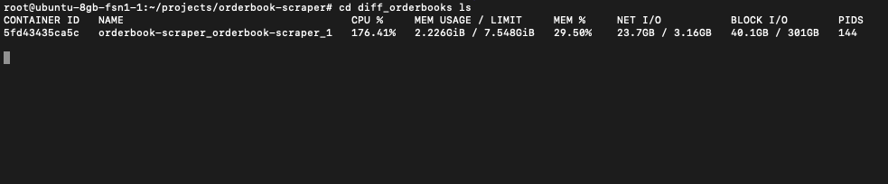

# Binance Orderbook Scraper (PREVIEW ONLY!)

A high-performance, production-ready orderbook data collection system for Binance Spot and Futures markets. The system captures both incremental (diff) and snapshot orderbook data via WebSocket streams and REST API endpoints.


## Features

- **Multi-Market Support**: Simultaneous data collection from Spot and Futures markets
- **Dual Data Types**: 
  - WebSocket streams for real-time orderbook updates (diff)
  - WebSocket streams for depth snapshots (partial)
  - REST API calls for full orderbook snapshots
- **High Performance**:
  - Utilizes uvloop for enhanced asyncio performance
  - Batched processing and efficient memory management
  - Optimized file I/O with compression
- **Production Ready**:
  - Robust error handling and automatic recovery
  - Comprehensive logging system
  - Memory-efficient data structures
  - Automatic date rollover handling

## System Requirements

- Python 3.9+
- 4 vCPU
- 8GB RAM
- ~5GB storage per day (varies with market volatility)
- Linux-based OS (tested on Ubuntu 22.04)

## Cost Efficiency

Running on Hetzner Cloud with:
- CAX21 (4 vCPU, 8GB RAM)
- Cost: ~$7.50 per month
- Handles 50+ symbols across Spot and Futures markets together




## Data Structure

### Orderbook Snapshots
```python
{
    "request_time": Int64,       # Request timestamp (microseconds)
    "received_time": Int64,      # Response timestamp (microseconds)
    "lastUpdateId": Int64,       # Binance sequence number
    "bid_prices": List[Float64], # List of bid prices
    "bid_sizes": List[Float64],  # List of bid quantities
    "ask_prices": List[Float64], # List of ask prices
    "ask_sizes": List[Float64],  # List of ask quantities
    "limit": Int32,             # Depth limit (1000)
    "symbol": String            # Trading pair
}
```
### Orderbook Diffs/Partial
```python
{
    "received_time": Int64,      # Processing timestamp (microseconds)
    "event_time": Int64,        # Binance event time
    "symbol": String,           # Trading pair
    "first_update_id": Int64,   # First update ID in event
    "final_update_id": Int64,   # Final update ID in event
    "bid_prices": List[Float64], # Updated bid prices
    "bid_sizes": List[Float64],  # Updated bid quantities
    "ask_prices": List[Float64], # Updated ask prices
    "ask_sizes": List[Float64]   # Updated ask quantities
}
```

## Data Storage

- **Format**: Apache Parquet
- **Compression**: ZSTD (level 9)
- **Directory Structure**:
  ```
  data/
  ├── spot/
  │   ├── orderbooks/         # REST API snapshots
  │   ├── partial_orderbooks/ # WebSocket snapshots
  │   └── diff_orderbooks/    # WebSocket updates
  └── futures/
      ├── orderbooks/         # REST API snapshots
      ├── partial_orderbooks/ # WebSocket snapshots
      └── diff_orderbooks/    # WebSocket updates
  ```
- **File Naming**: `YYYY-MM-DD.parquet`
- **Typical Sizes**:
  - Full Snapshots files: ~5MB/day/symbol = 1min frequency
  - Partial stream: ~25MB/day/symbol = 250ms frequency
  - Diff stream: ~40MB/day/symbol = 500ms frequency
  - Total: ~5-7.5GB/day (50 symbols for both spot/futures market)

## Performance Metrics

- WebSocket message processing rate: ~480 messages/minute/symbol (futures + spot)
- REST API snapshot frequency: 1 snapshot/minute/symbol (futures + spot)
- Memory usage: ~4GB steady state
- CPU usage: 60-90% across 4 vCPUs


## Installation example

1. Clone the repository:
```bash
git clone https://github.com/yourusername/orderbook-scraper.git
cd orderbook-scraper
```

2. Configure environment variables:
```bash
# Create .env file with your R2 storage credentials
cp .env.example .env

# Edit .env with your credentials
R2_ENDPOINT_URL=your_endpoint_url
R2_ACCESS_KEY_ID=your_access_key
R2_SECRET_ACCESS_KEY=your_secret_key
R2_BUCKET_NAME=your_bucket_name
```

3. Configure symbols in `src/config.py` (optional, default config includes 50 most active pairs)

4. Build and start the container:
```bash
docker-compose up -d --build
```

## Usage

### Starting the Service
```bash
# Start all services
docker-compose up -d

# View logs
docker-compose logs -f

# Check service status
docker-compose ps
```

### Monitoring Logs
```bash
# View all logs
tail -f logs/*.log

# View specific component logs
tail -f logs/spot_wss.log      # Spot WebSocket handler
tail -f logs/futures_wss.log   # Futures WebSocket handler
tail -f logs/snapshot_output.log      # REST API snapshots
tail -f logs/daily_uploader.log       # Data upload service
```

### Managing the Service
```bash
# Stop the service
docker-compose down

# Restart the service
docker-compose restart

# Update and rebuild
docker-compose down
docker-compose up -d --build
```

### Data Directory Structure
```bash
orderbooks/           # REST API snapshots
diff_orderbooks/      # WebSocket updates
partial_orderbooks/   # WebSocket snapshots
logs/                 # Service logs
```

## Features Deep Dive

### Memory Management
- Batched processing with configurable batch sizes
- Periodic garbage collection
- Memory-mapped file I/O
- Efficient data structures using polars DataFrame

### Error Handling
- Exponential backoff for reconnections
- Automatic session refresh
- Rate limit awareness
- Comprehensive exception handling

### Data Integrity
- Sequence number tracking
- Timestamp validation
- Automatic data validation
- Duplicate detection

### Performance Optimization
- uvloop for async operations
- Batched file I/O operations
- Efficient compression (ZSTD)
- Connection pooling
- Multi-threading for REST API calls

## Configuration

Key configuration parameters can be adjusted in the respective files:

### WebSocket Handlers
- `SYMBOLS_PER_CONNECTION`: Number of symbols per WebSocket connection
- `MAX_RECONNECT_ATTEMPTS`: Maximum reconnection attempts
- `RESET_RECONNECT_AFTER`: Time before resetting reconnection counter

### Data Managers
- `MAX_BUFFER_SIZE`: Maximum messages before forcing write
- `SAVE_INTERVAL`: Regular save interval
- `BATCH_SIZE`: Messages processed in one batch
- `COMPRESSION_LEVEL`: ZSTD compression level

## Acknowledgments

- [Binance API Documentation](https://binance-docs.github.io/apidocs/)
- [polars](https://pola-rs.github.io/polars/) for efficient data handling
- [websocket-client](https://websocket-client.readthedocs.io/) for WebSocket connections
- [uvloop](https://github.com/MagicStack/uvloop) for enhanced async performance

## Contact

Contact me on GitHub: [@mpanac](https://github.com/mpanac)